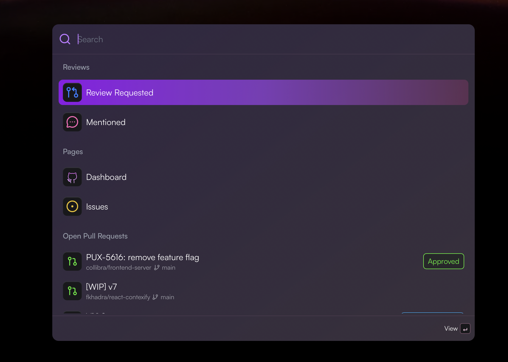
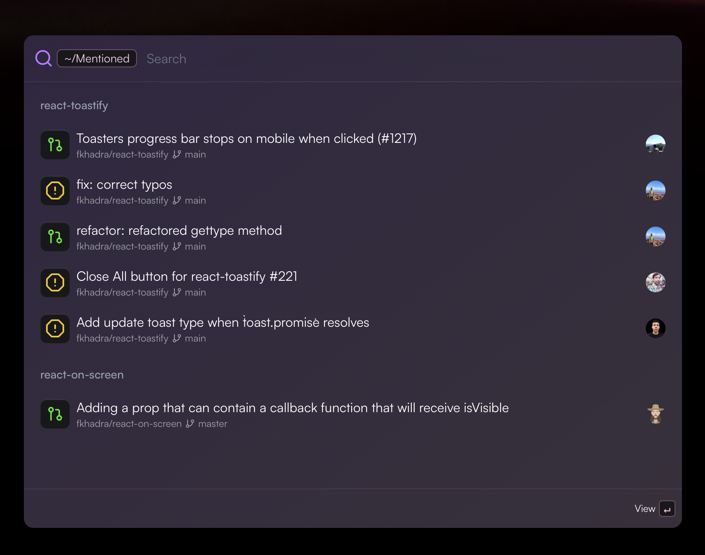
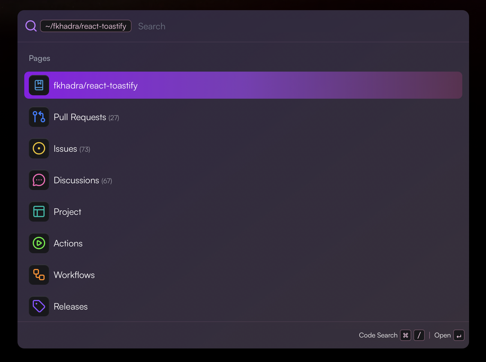
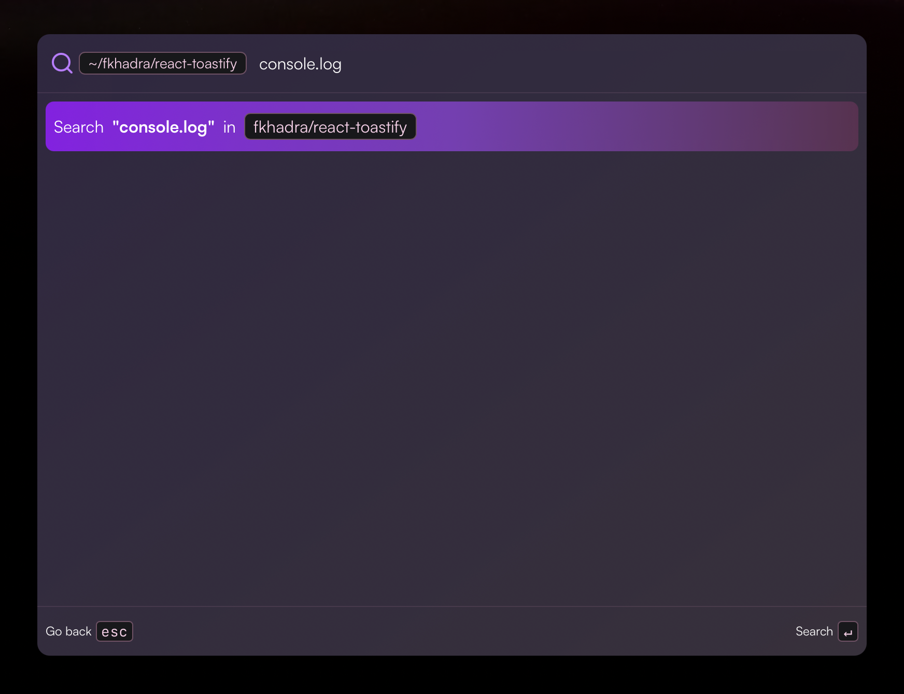
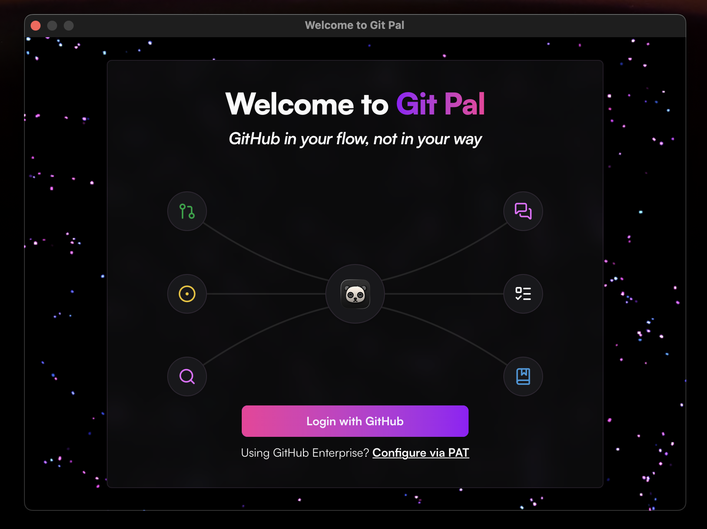

<div align="center">
  
  <h1>Git Pal</h1>
  <p><strong>Git in your flow, not in your way</strong></p>
  <p>A beautiful command palette for GitHub. Quickly access your pull requests, repositories, and workflows without leaving your keyboard.</p>

  <div>
    
    
    
    
  </div>
</div>

<br />

<p align="center">
  
</p>

## Features

### Pull Requests & Mentions

See review requests and mentions in one centralized place.

<p align="center">
  
</p>

### Repository Browser

Browse your repositories and organizations.

<p align="center">
  
</p>

### Code Search

Search code across your repositories powered by GitHub's search. Scope searches to a specific organization or repository.

<p align="center">
  
</p>

### GitHub Integration

Seamless OAuth authentication with support for GitHub Enterprise via personal access tokens.

<p align="center">
  
</p>

### More

- **Global shortcut** — Summon the palette from anywhere with a keyboard shortcut (default `Cmd+G`, configurable)
- **Workflow runner** — List and trigger GitHub Actions workflows with custom inputs
- **Auto-updates** — Get notified when a new version is available
- **Launch on login** — Optionally start Git Pal when your system boots
- **Secure** — OAuth tokens stored in the system keychain. Settings stored locally at `~/.config/git-pal`. No telemetry

## Installation

Download the latest [installer](https://gitpal.pushpull.sh/), open it, and drag Git Pal into your Applications folder.

| Platform | Status |
|----------|--------|
| macOS | ✅ |
| Windows | ✅ |
| Linux | Coming soon |

## Development

### Prerequisites

- [Node.js](https://nodejs.org/) (LTS)
- [pnpm](https://pnpm.io/)
- [Rust](https://rustup.rs/)
- Tauri v2 [system dependencies](https://v2.tauri.app/start/prerequisites/)

### Getting started

```bash
# Install dependencies
pnpm install

# Run in development mode (starts both Vite dev server and Tauri)
pnpm tauri dev

# Build for production
pnpm tauri build
```

## FAQ

**Why does it ask for my password on the first launch?**
Git Pal stores the OAuth token in the system keychain. macOS requires your password to authorize keychain access on first use.

**Does it support GitHub Enterprise?**
Yes — connect using a personal access token (PAT).

**Is my data secure?**
All data stays on your machine. Settings are stored locally at `~/.config/git-pal`, tokens live in the system keychain, and there is no telemetry.

## License

MIT
