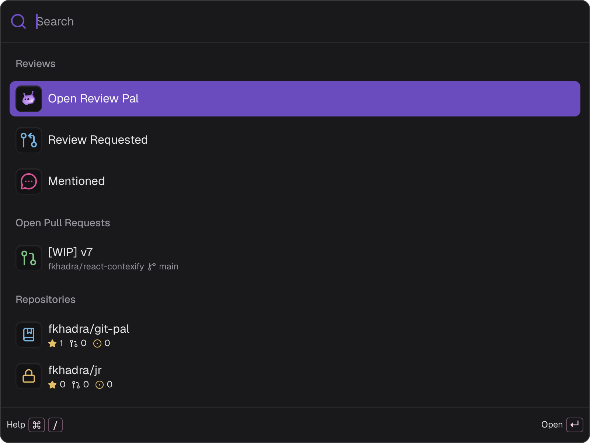
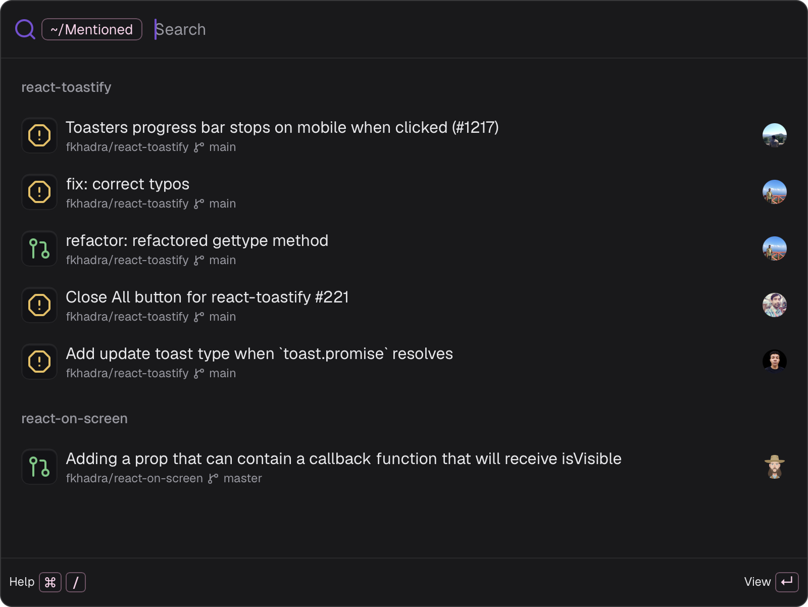
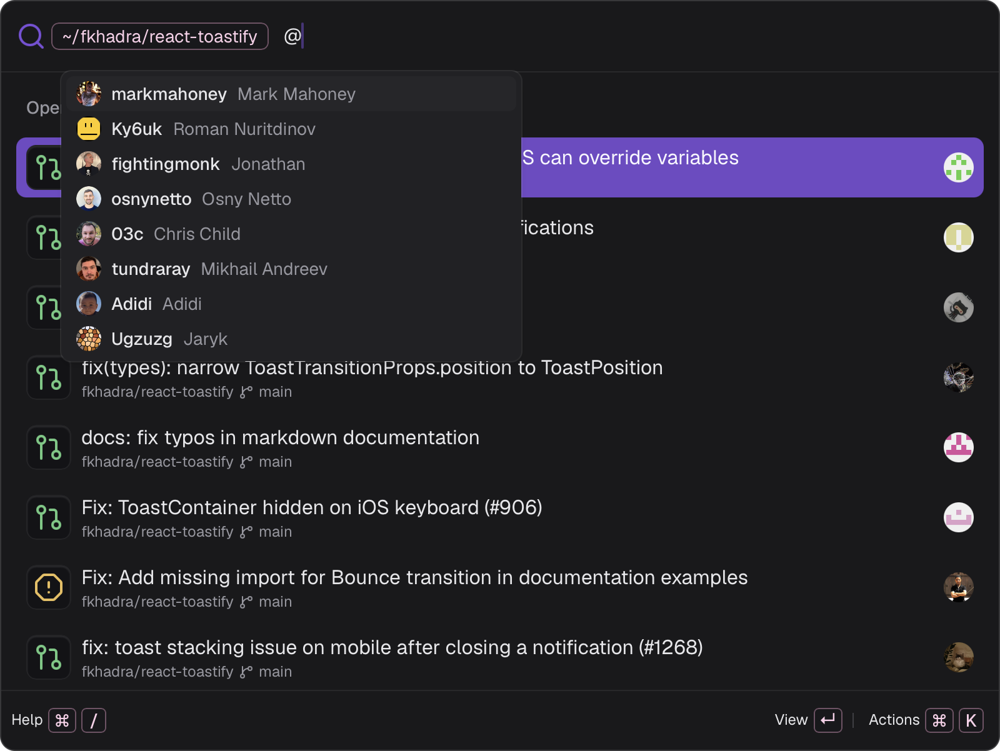
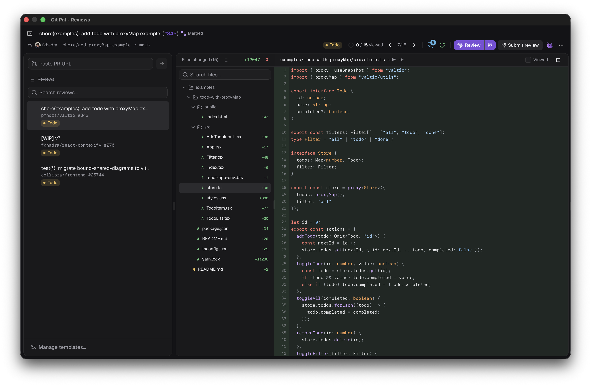
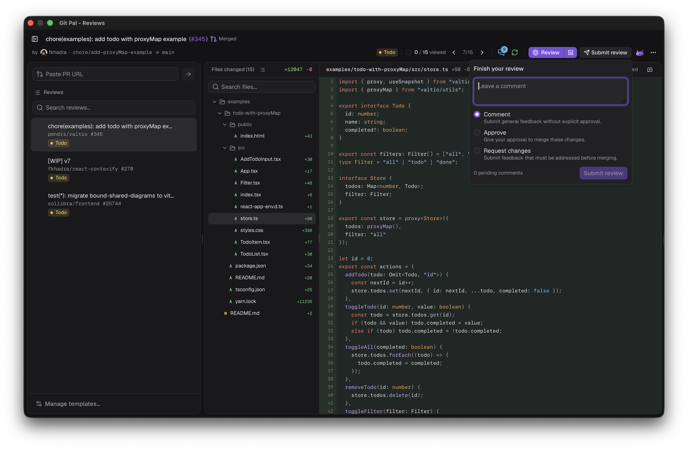
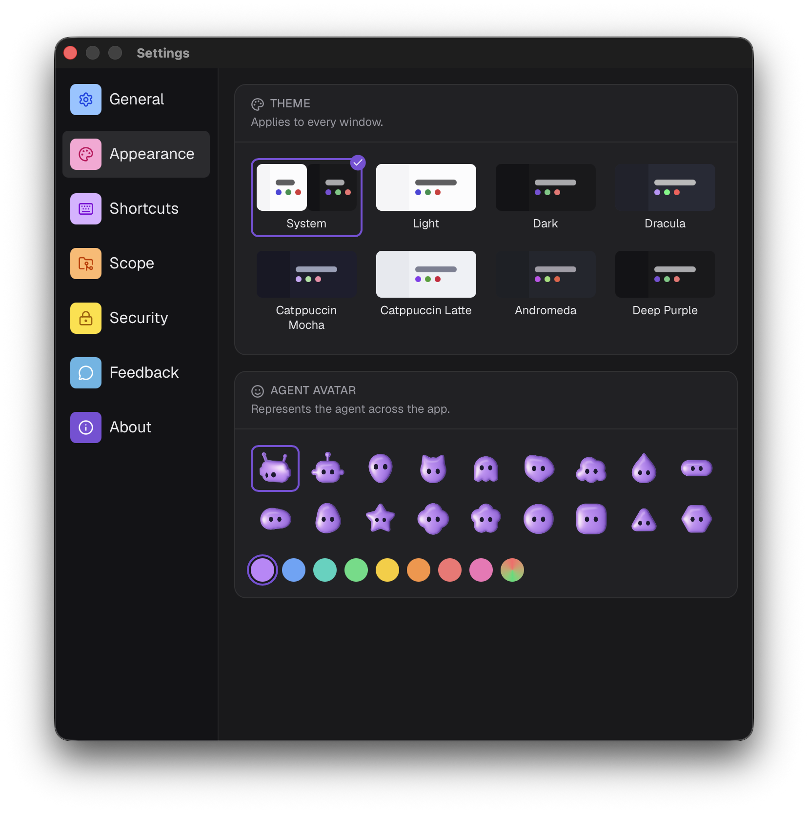

<div align="center">
  
  <h1>Git Pal</h1>
  <p><strong>GitHub in your flow, not in your way</strong></p>
  <p>A keyboard-first companion for pull requests, with AI reviews built in. Find what needs you from anywhere, let an agent review it, and submit your review without leaving the app.</p>

  <div>
    
    
    
    
  </div>
</div>

<br />

<p align="center">
  
</p>

## Features

### Command palette

Press <kbd>⌘</kbd> <kbd>G</kbd> (<kbd>Ctrl</kbd> <kbd>G</kbd> on Linux, <kbd>Ctrl</kbd> <kbd>Win</kbd> <kbd>G</kbd> on Windows) from any app. Review requests, mentions, your open pull requests and repositories are one search away.

<p align="center">
  
</p>

Browse a repository's pull requests and type `@` to filter by author. Every action is a shortcut away: view, review, open on GitHub or search the code.

<p align="center">
  
</p>

### AI code review

Let Claude Code, Codex, Cursor, Antigravity or OpenCode review a pull request while you keep working. Git Pal checks it out in a separate worktree, and the agent can only read the code.

When it's done, its comments show up right in the diff. Keep, edit or drop them, add your own notes, then submit.

<p align="center">
  
</p>

- **Templates**: review instructions and agent skills per repository, picked automatically
- **Incremental reviews**: review only the commits pushed since the last review
- **GitHub threads**: existing discussions show inline, with the conversation and the agent's summary a click away
- **Open in your editor**: jump into the worktree from your IDE or terminal to tweak code or run the build

<p align="center">
  
</p>

### Agent chat

Ask about the changes, the risks or a specific comment. The agent already sees the file you're on, and you can add more with `@`.

<p align="center">
  
</p>

### Make it yours

Pick a theme and an avatar for your agent, remap any shortcut, and choose which repositories Git Pal watches.

<p align="center">
  
</p>

### More

- **Notifications**: know when your review is requested
- **Menu bar and Dock**: see agents working, and how many reviews wait on you
- **Updates**: downloaded in the background, installed when you say so
- **Launch on login**
- **Private**: your token stays in the system keychain, settings in `~/.config/git-pal`. No telemetry

## Installation

Download the installer for your platform from the [latest release](https://github.com/fkhadra/git-pal/releases/latest). Git Pal updates itself afterwards.

### macOS

Download the `.dmg`: `aarch64` for Apple Silicon, `x64` for Intel. Open it and drag Git Pal into your Applications folder.

### Windows

Download the `-setup.exe` (or the `.msi`) and run it.

### Linux

Download the package for your distribution:

- **Debian / Ubuntu**: `sudo apt install ./Git.Pal_*_amd64.deb`
- **Fedora / RHEL**: `sudo dnf install ./Git.Pal-*.x86_64.rpm`
- **Other**: make the `.AppImage` executable with `chmod +x` and run it

Git Pal stores your token through the Secret Service API, so a keyring such as GNOME Keyring or KWallet must be running.

### AI reviews

Reviews run a coding agent installed on your machine. Install one and make sure its command is on your `PATH`: `claude`, `codex`, `cursor-agent`, `agy` or `opencode`.

## Development

### Prerequisites

- Node.js, pnpm and Rust, at the versions in [`mise.toml`](mise.toml) (`mise install` sets them up)
- Tauri v2 [system dependencies](https://v2.tauri.app/start/prerequisites/)
- `GIT_PAL_CLIENT_SECRET`: the GitHub OAuth app's client secret, read at compile time

> [!NOTE]
> `GIT_PAL_CLIENT_SECRET` is only needed to build a release. During development it can be empty, but it must be set (`export GIT_PAL_CLIENT_SECRET=`). Without it, sign in with a personal access token: click **Use a token** on the welcome window.

### Getting started

```bash
# Install dependencies
pnpm install

# Run in development mode (starts both Vite dev server and Tauri)
pnpm tauri dev

# Build for production
pnpm tauri build
```

### Code generation

TypeScript models are generated from the Rust types. Regenerate them after changing a shared type:

```bash
# TypeScript models only
mise run codegen:ts

# GraphQL queries, then TypeScript models
mise run codegen:gql
```

## FAQ

**Why does it ask for my password on the first launch?**
Git Pal stores the OAuth token in the system keychain. macOS requires your password to authorize keychain access on first use.

**Does it support GitHub Enterprise?**
Not yet. Git Pal only talks to `github.com` for now.

**Is my data secure?**
All data stays on your machine. Settings and reviews are stored locally at `~/.config/git-pal`, tokens live in the system keychain, and there is no telemetry. Agents run locally and can only read the pull request's code.

## License

Licensed under either of [Apache License, Version 2.0](LICENSE-APACHE) or [MIT license](LICENSE-MIT), at your option.
