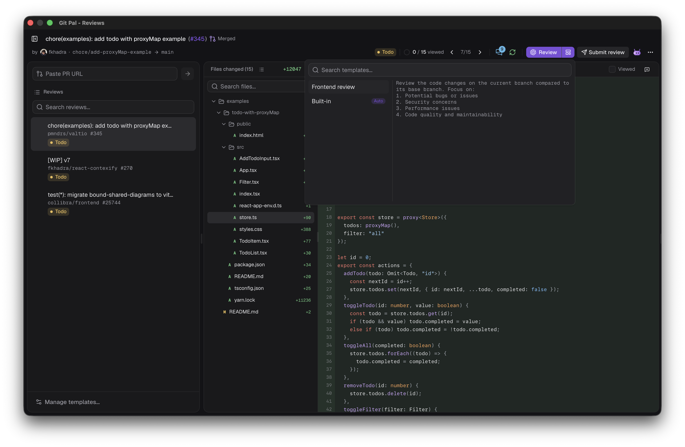
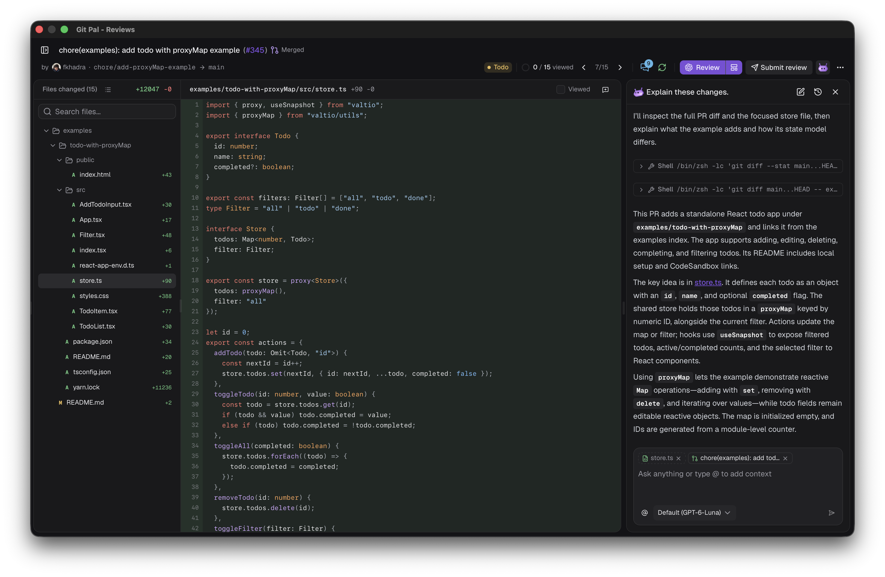
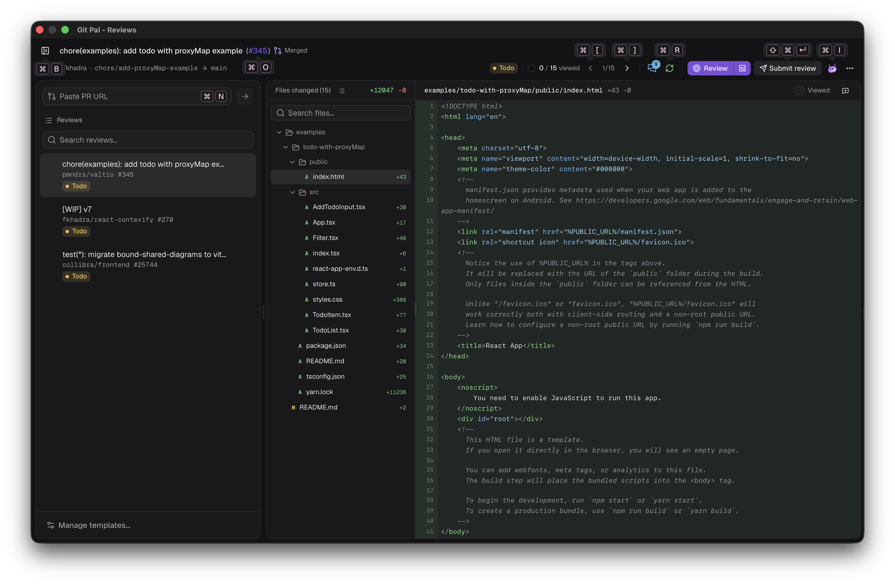

# Code review

The review window, Review Pal, is where you read pull requests, have an agent review them and submit your review to GitHub.

## Open a pull request

- From the palette: <kbd>↵</kbd> to view a pull request, <kbd>⌘</kbd> <kbd>↵</kbd> to review it.
- From the review window: paste a URL (`https://github.com/owner/repo/pull/123`) or `owner/repo#123` in **Paste PR URL**. <kbd>↵</kbd> starts a review, the arrow button lets you **View**, **Review** or **Review with template**.
- From the menu bar: **Reviews**.
- From a review request notification.

Every pull request you open stays in the **Reviews** list on the left, with its status.

## AI reviews

Git Pal clones the repository, checks out the pull request in its own worktree and asks your agent to review it. The agent gets the description and the existing discussion, so it doesn't repeat what's already been said.

Pick the agent, called the harness, and its model in [Settings > General](./settings#general). Agents only read files and run git, they can't change your code or talk to GitHub.

While it runs, the button reads **Reviewing with Claude Code**. Click **Cancel** to stop it. Hover the harness logo next to the status to see who reviewed, with which model and template, and when.

### Templates

A template holds the instructions the agent follows. Without one, the built-in instructions focus on bugs, security, performance and maintainability.

Click **Manage templates…** at the bottom of the reviews list to create one:

| Field | Purpose |
| --- | --- |
| Name | Shown in the template picker |
| Instructions | What to look for. The output format and the discussion are added for you |
| Skills | Installed agent skills the review must use |
| When to use | A regex on `owner/repo`, e.g. `^acme/` |
| Default template | Used when no matcher accepts the repository |

Drag templates to reorder them. **Auto** picks the template used last time on that pull request, else the first one whose matcher accepts the repository, else the default one, else the built-in instructions.

### New commits

When the pull request changes after a review, a banner offers to **Review new commits**, keeping existing comments, or to **Re-review everything**. To start over at any time, use **Review again** in the **⋯** menu. AI comments you haven't posted are replaced, your notes are kept.

## Comments

AI comments are tagged **Error**, **Warning** or **Info**, and appear under the lines they're about. Nothing is posted until you say so:

- **Add to review** queues the comment. It then reads **In review**, hover it to **Remove** it.
- The pencil edits it.
- **Ask AI** sends it to the [agent chat](#agent-chat).

### Your notes

Click a line number to comment on it, drag or <kbd>⇧</kbd>-click to comment on several lines, or use the file header's button to comment on the whole file. Type `@` to mention someone and `:` for emoji. <kbd>⌘</kbd> <kbd>↵</kbd> saves the note.

Notes and queued AI comments are posted with your next review.

### GitHub threads

Existing review threads show in the diff. Open them on GitHub, ask the agent about them, or edit and delete your own.

## Submit

**Submit review** shows how many comments are pending. Write an optional summary and pick:

- **Comment**: feedback without explicit approval.
- **Approve**: approve the changes.
- **Request changes**: feedback that must be addressed before merging.

## Status

| Status | Meaning |
| --- | --- |
| Todo | Not reviewed yet |
| In progress | An agent is reviewing, or there's something to submit |
| Approved | You approved |
| Change requested | You requested changes |
| Feedback submitted | You commented |

A new commit or a pending comment puts a submitted pull request back in progress.

## Files and diff

- The file tree shows each file's changes and comments, colored by severity. Switch between tree and list, search with <kbd>⇧</kbd> <kbd>⌘</kbd> <kbd>F</kbd>, and show **Only files owned by me** when the repository has a `CODEOWNERS` file.
- Tick **Viewed** to dim a file and jump to the next one. A viewed file that changes is unticked.
- Switch between split and unified diffs with <kbd>⌘</kbd> <kbd>S</kbd>. Narrow windows switch to unified on their own.
- Expand hidden lines around each hunk, and find in the file with <kbd>⌘</kbd> <kbd>F</kbd>.

## Conversation and summary

The header buttons open the pull request's **Conversation** (description, reviews and comments) and the agent's **Review summary**. A dot marks a summary you haven't read.

## Open in your editor

The **⋯** menu opens the pull request's worktree in your editor, or copies its path. Git Pal finds VS Code, Cursor, Windsurf, Zed, Sublime Text and the JetBrains IDEs.

## Agent chat

Press <kbd>⌘</kbd> <kbd>I</kbd> to chat with the agent about the pull request. It runs in the pull request's worktree and sees the file you're on. Type `@` to add files or comments as context. Chats are saved per pull request, find older ones in **History**.

## Shortcuts

Windows and Linux use <kbd>Ctrl</kbd> where macOS uses <kbd>⌘</kbd>. Hold <kbd>⌘</kbd> to see shortcut hints on buttons, press <kbd>⌘</kbd> <kbd>/</kbd> to list them.

| Action | macOS |
| --- | --- |
| Hide or show reviews | <kbd>⌘</kbd> <kbd>B</kbd> |
| Previous file | <kbd>⌘</kbd> <kbd>[</kbd> |
| Next file | <kbd>⌘</kbd> <kbd>]</kbd> |
| Check for updates | <kbd>⌘</kbd> <kbd>R</kbd> |
| Split or unified view | <kbd>⌘</kbd> <kbd>S</kbd> |
| Submit review | <kbd>⇧</kbd> <kbd>⌘</kbd> <kbd>↵</kbd> |
| Open on GitHub | <kbd>⌘</kbd> <kbd>O</kbd> |
| Agent | <kbd>⌘</kbd> <kbd>I</kbd> |
| Keyboard shortcuts | <kbd>⌘</kbd> <kbd>/</kbd> |
| Find in file | <kbd>⌘</kbd> <kbd>F</kbd> |
| Search files | <kbd>⇧</kbd> <kbd>⌘</kbd> <kbd>F</kbd> |
| Paste pull request URL | <kbd>⌘</kbd> <kbd>N</kbd> |
