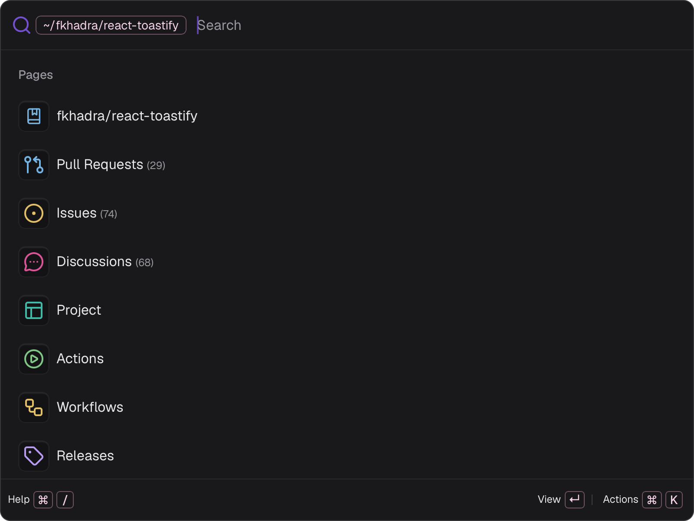
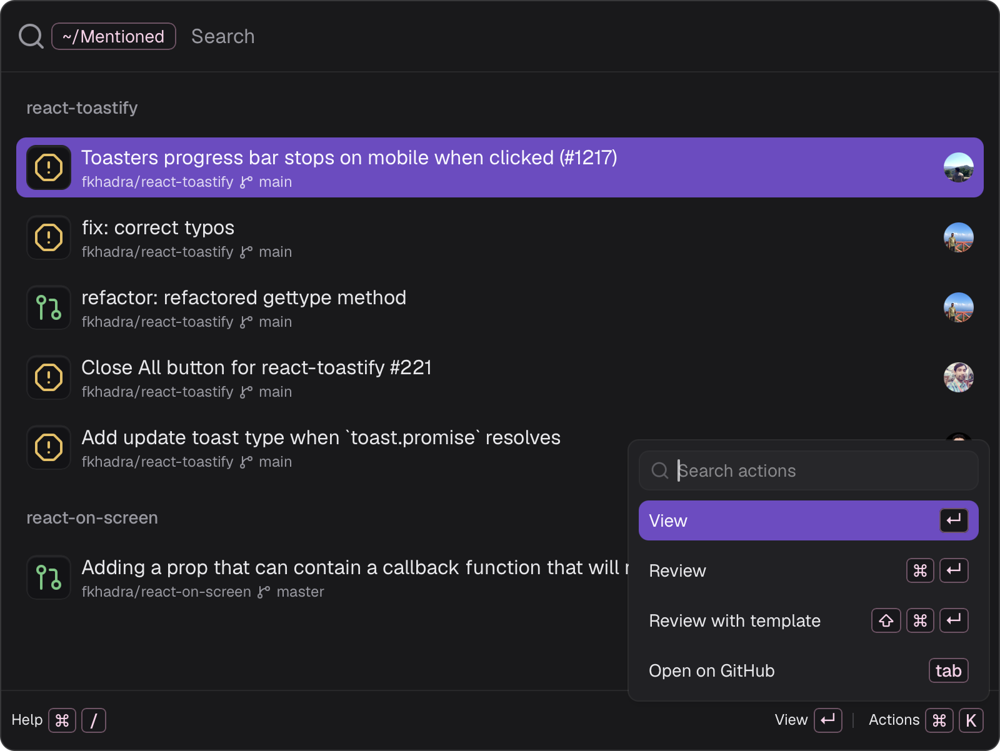

# Command palette

The palette is Git Pal's home. Press the global shortcut from any app to open it, it hides as soon as it loses focus and reopens on the home page.

## Home

| Group | Content |
| --- | --- |
| **Reviews** | **Open Review Pal** opens the review window. **Review Requested** and **Mentioned** list the open pull requests waiting on you. |
| **Open Pull Requests** | Your 10 most recent open pull requests. |
| **Repositories** | Your top 10 repositories by stars. |
| **Pages** | GitHub's **Dashboard** and **Issues**. |
| **Organizations** | The organizations you belong to. |

Type to filter the current page. Press <kbd>Backspace</kbd> on an empty search, or <kbd>Esc</kbd>, to go back. <kbd>Esc</kbd> on the home page hides the palette.

**Review Requested**, **Mentioned**, notifications and repository lists follow your [search scope](./settings#scope). Your own pull requests always show.

## Pull requests

Each pull request shows its repository, base branch, status and review decision.

| Status | Meaning |
| --- | --- |
| Checks running | CI is running, or the pull request is in the merge queue |
| Draft | Work in progress |
| Checks failed | Some checks failed |
| Changes requested | A reviewer requested changes |
| Merge conflicts | Conflicts must be resolved |
| Ready to merge | All checks passed |
| Merged | Already merged |

The badge on the right is GitHub's review decision: **Approved**, **Review required** or **Changes requested**.

| Action | Shortcut |
| --- | --- |
| **View** in the review window, without an AI review | <kbd>↵</kbd> |
| **Review** with an agent | <kbd>⌘</kbd> <kbd>↵</kbd> |
| **Review with template** | <kbd>⇧</kbd> <kbd>⌘</kbd> <kbd>↵</kbd> |
| **Open on GitHub** | <kbd>Tab</kbd> |

## Repositories

Select a repository to browse it:

- **Pull Requests**: its open pull requests, searched on GitHub as you type.
- **Issues**, **Discussions**, **Project**, **Wiki**, **Actions** and **Releases**: open on GitHub.

### Filter by author

On a repository's pull requests, type `@` followed by a login. Pick a suggestion with <kbd>↵</kbd> or <kbd>Tab</kbd> and it becomes a chip. Add as many authors as you like, <kbd>Backspace</kbd> on an empty search removes the last one.

## Organizations

<kbd>Tab</kbd> on an organization browses its repositories, searched on GitHub as you type. <kbd>↵</kbd> opens it on GitHub.

## Code search

Press <kbd>⌘</kbd> <kbd>F</kbd> on a repository or an organization, type your query and press <kbd>↵</kbd>. The results open in GitHub's code search.

## Actions

Press <kbd>⌘</kbd> <kbd>K</kbd> to list every action available on the selected item, with its shortcut. The footer shows the main one.

## Shortcuts

Windows and Linux use <kbd>Ctrl</kbd> where macOS uses <kbd>⌘</kbd>. Press <kbd>⌘</kbd> <kbd>/</kbd> in the palette to see yours, change them in [Settings > Shortcuts](./settings#shortcuts).

| Action | macOS |
| --- | --- |
| Open or view | <kbd>↵</kbd> |
| Browse organization, or open on GitHub | <kbd>Tab</kbd> |
| Show actions | <kbd>⌘</kbd> <kbd>K</kbd> |
| Review | <kbd>⌘</kbd> <kbd>↵</kbd> |
| Review with template | <kbd>⇧</kbd> <kbd>⌘</kbd> <kbd>↵</kbd> |
| Code search | <kbd>⌘</kbd> <kbd>F</kbd> |
| Help | <kbd>⌘</kbd> <kbd>/</kbd> |
| Go back | <kbd>Backspace</kbd> |
| Cancel | <kbd>Esc</kbd> |

## Notifications

With **Review requests** turned on in [Settings > General](./settings#notifications), Git Pal checks GitHub every 20 seconds by default and notifies you when someone requests your review. Click the notification to open the pull request.

You're also notified when an agent finishes a review while the review window isn't focused.
