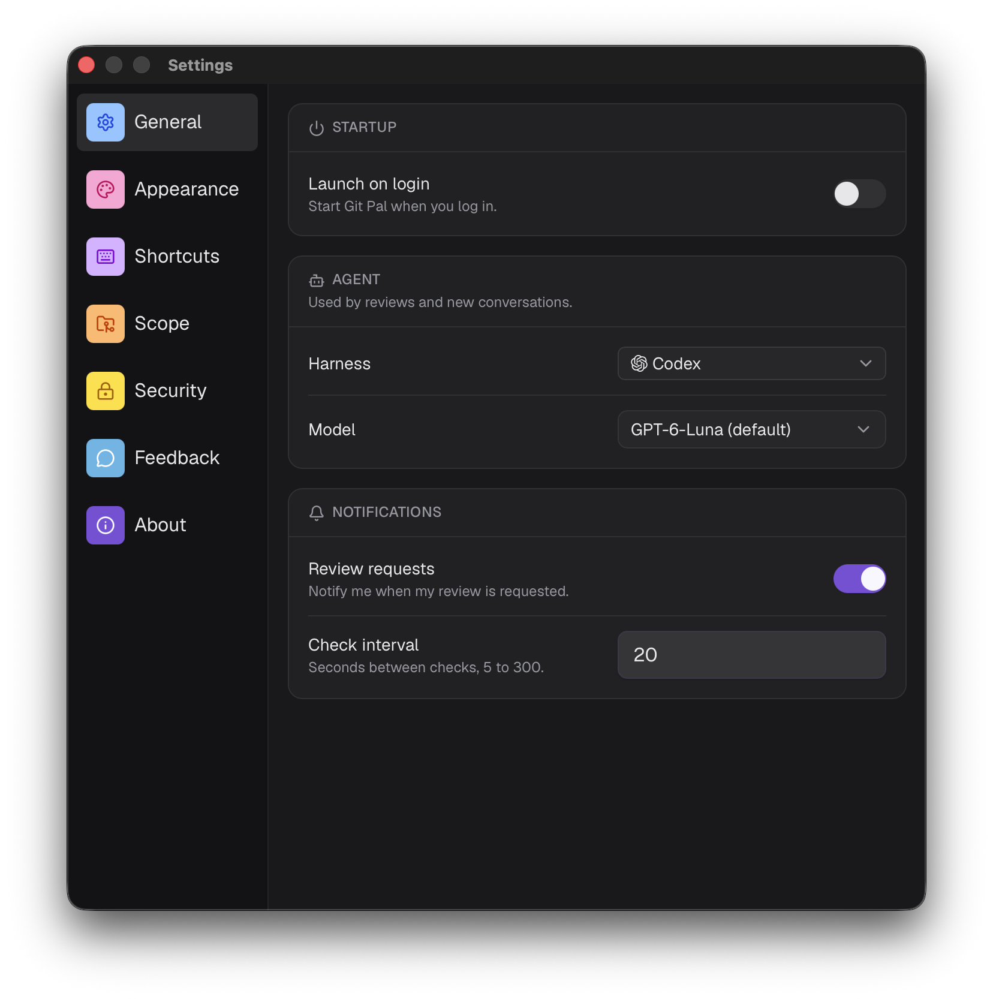
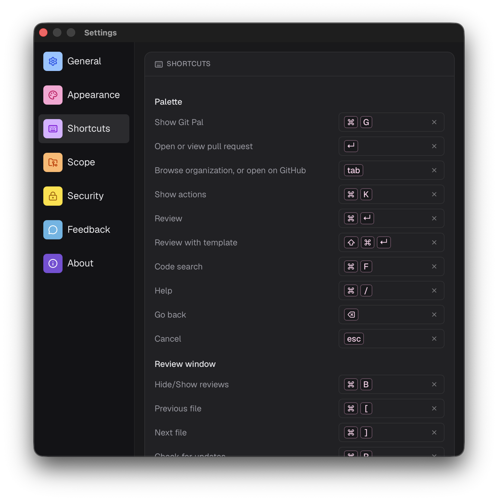
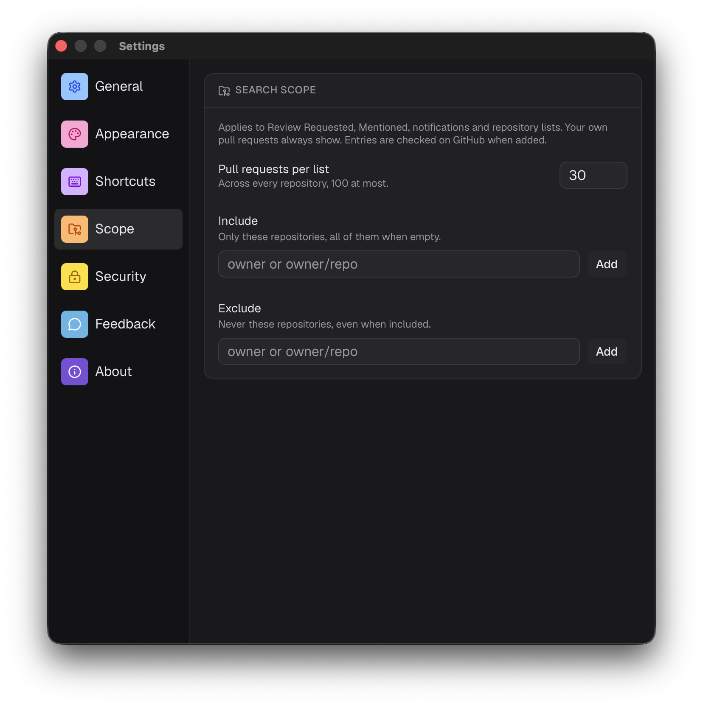
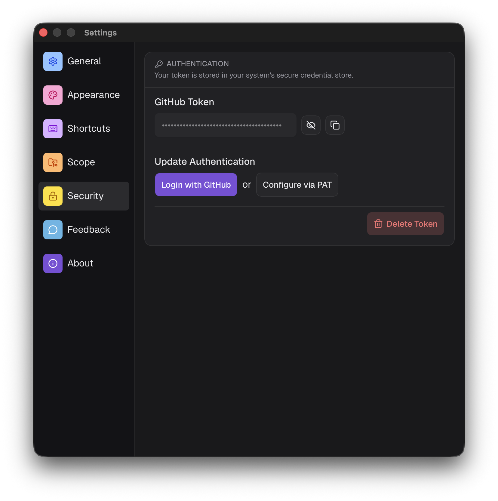

# Settings

Open the settings from the menu bar icon, **Settings**. Changes apply right away.

## General

### Startup

**Launch on login** starts Git Pal when you log in.

### Agent

Used by reviews and new chats.

- **Harness**: Claude Code, Codex, Cursor, Antigravity or OpenCode. See [installation](./installation#ai-reviews).
- **Model**: the models your harness offers, marked **(default)** for the harness's own default. Saved per harness.

### Notifications

- **Review requests**: notify me when my review is requested.
- **Check interval**: seconds between checks, from 5 to 300. 20 by default.

## Appearance

- **Theme**: System, Light, Dark, Dracula, Catppuccin Mocha, Catppuccin Latte, Andromeda or Deep Purple. Applies to every window.
- **Agent avatar**: the shape and color representing the agent across the app.

## Shortcuts

Click a shortcut and press the new keys. The **×** button restores the default.

- **Palette**: starts with **Show Git Pal**, the global shortcut, then the [palette shortcuts](./command-palette#shortcuts).
- **Review window**: the [review shortcuts](./code-review#shortcuts). They need a modifier key.

A shortcut can't be used twice in the same list.

## Scope

Narrows **Review Requested**, **Mentioned**, notifications and repository lists. Your own pull requests always show.

- **Pull requests per list**: up to 100, 30 by default.
- **Include**: only these repositories, all of them when empty.
- **Exclude**: never these repositories, even when included.

Add an owner (`acme`) or a repository (`acme/api`). Entries are checked on GitHub when added.

:::tip
GitHub limits how long a search can be. With many entries, Git Pal filters the results itself and a warning tells you some pull requests may be missing.
:::

## Security

Your token is stored in your system's secure credential store.

- **GitHub Token**: show or copy it, with its expiry date when it has one.
- **Update Authentication**: sign in with GitHub again, or use a personal access token.
- **Delete Token**: removes it, you'll need to sign in again.

## Feedback

Send an idea, a bug report or anything else. Your email is required.

## About

The version you're running.
